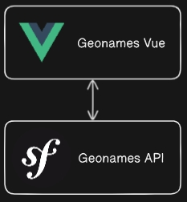

# Geonames Vue

"Reverse/Geocoding Webservices": this repository contains the Geonames front-end part, built on a VueJS 3.3 + Vite 5.0 base.

Keep in mind this app was made by a stagios who does not know anything about Vue.js and frontend in general.

## Schema

Instead of using Symfony's twig render functions, we decided to use it as a pure API, a headless system which we plug a Vue.js app onto.



## Deployment

```bash
  git clone https://github.com/Gatoreviews/geonames-vue.git
  yarn run dev
```
will run on 
```bash
  http://localhost:5173/
```

## What does it do ?

There are basically 3 pages : 
- homepage
- country list
- translations edition 

The country list will render a list of the known countrycodes in the database
It will try to reach for the Symfony Geonames API (see https://github.com/uglykidmat/geonames) and log the JSON response of a call.

The translations part's goal is to create, modify and delete translations via a form/list.
- POST a new translation through the form : required data are geonameId, new translation, country code, locale (language the translation is in).
- PATCH (modifiy) existing translations
- GET search translations by countrycode
- DELETE existing translations
